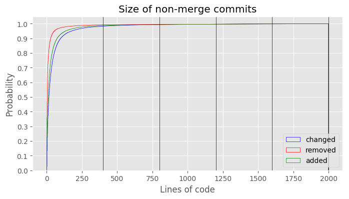

# Commit patch size distribution

Calculate and plot cumulative distribution functions of the *added*, *removed*,
and *total changed* lines of all non-merge commits in a Git repository.

Run `commit-size-distribution.py` with the path to a Git repository, specifying
either the `--preview` flag, a location to save the plot as a PNG, or both.

## Example

The [sample](sample) directory contains a plot of Git's own commit size
distribution, generated with:

```sh
./commit-size-distribution.py --max-size 2000 --mark-hours ../git/ sample/git.png
```



The **`--mark-hours`** option draws vertical lines at increments of 400 to
indicate how many hours the data point would take to review. In a famous study
of code review of a multi-million line Java application at Cisco Systems,
[SmartBear found][cisco] that

- defects discovered approaches zero at 400 lines of inspection;
- reviewing more than 400 lines of code per hour greatly reduces the number of
  defects found; and
- mental fatigue sets in after about 60 minutes of review.

The optimal rate of inspection will vary with language and context but 400 is
a nice round number.

The **`--max-size`** option causes any data point in the respective graph above
the supplied value to be discarded. This is useful to indicate that commits
above a certain size are not realistically thoroughly reviewable, such as style
changes across an entire code base.

## Installation

```sh
$ python3 -m venv venv
$ . venv/bin/activate
$ pip install -r requirements.txt
```

[cisco]: https://www.ibm.com/developerworks/rational/library/11-proven-practices-for-peer-review/
